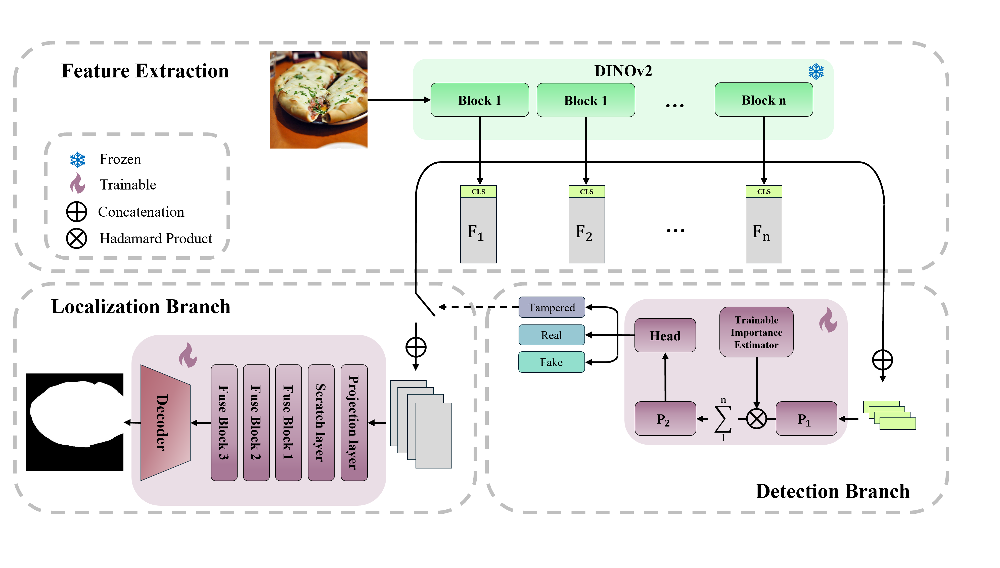

# From Detection to Localization: A Unified Forensics Framework for Fully Synthetic and Tampered Images

[](https://arxiv.org/abs/2609.02640)

Official implementation of *"From Detection to Localization: A Unified Forensics Framework for
Fully Synthetic and Tampered Images"* ([arXiv:2609.02640](https://arxiv.org/abs/2609.02640)),
accepted at the **ACM Multimedia 2026 Workshop on DeepFake Forensics (DFF)**.

Annalisa Gallina, Marco Fiorucci, Marco Brigo, Federica Battisti, Lamberto Ballan

---

## Overview

The rapid advancement of generative models has significantly worsened the problem of manipulated
image detection, as these methods are capable of producing highly realistic forgeries,
reinforcing the importance of multimedia forensics. Conventional approaches typically frame image
manipulation detection as a binary classification task (real vs. generated), which limits the
capability to distinguish and localize different forms of manipulation. To address these
constraints, this work extends an existing detector by introducing a unified multiclass framework
(real vs. fully generated vs. tampered). In addition to classifying image authenticity, the
framework incorporates a segmentation branch to enable pixel-level localization of tampered
regions. The proposed approach outperforms selected recent benchmarks, offering an efficient
solution with improved classification accuracy and higher IoU scores for the localization task.

<p align="center">
  
</p>


## Installation

```bash
git clone https://github.com/anngal01/From-Detection-to-Localization-A-Unified-Forensics-Framework-for-Fully-Synthetic-and-Tampered-Images.git
cd From-Detection-to-Localization-A-Unified-Forensics-Framework-for-Fully-Synthetic-and-Tampered-Images
pip install -r requirements.txt
```

A CUDA GPU is required for training and strongly recommended for evaluation.

Two dependencies are optional and left commented out in `requirements.txt`: `fvcore`, needed only
for the FLOP count in the efficiency benchmark, and OpenAI `clip`, needed only for the legacy CLIP
ViT-L/14 backbone that the DINOv2 pipeline does not use.

To reproduce the exact environment used for the paper's results instead — linux-64,
Python 3.14, PyTorch 2.10 with CUDA 13.0 — use the conda environment file:

```bash
conda env create -f environment.yml
conda activate <env_name>
```

---

## Data

Experiments use [So-Fake-Set](https://huggingface.co/datasets/saberzl/So-Fake-Set);
[SID_Set](https://huggingface.co/datasets/saberzl/SID_Set) is also supported.


Three loading modes are available:

| Mode | Behaviour |
|---|---|
| `streaming` *(default)* | Streams from the Hugging Face hub; nothing is stored locally. |
| `hf` | Downloads the dataset once, then reads it from the HF cache. |
| `local` | Reads from `DATA_ROOT` on disk. |


<!--
---

## Configuration

No paths are hardcoded. Everything resolves relative to the repository root and can be redirected
with environment variables — useful on a cluster where data and checkpoints live on a different
filesystem from the code.

| Variable | Default | Purpose |
|---|---|---|
| `CKPT_DIR` | `<repo>/ckpt` | where checkpoints are written and read |
| `OUTPUT_DIR` | `<repo>/outputs` | where evaluation dumps masks, overlays and metrics |
| `DATA_ROOT` | *(unset)* | dataset root, for `local` mode only |
| `WANDB_MODE` | `disabled` | set to `online` to enable Weights & Biases logging |
| `WANDB_ENTITY` | logged-in user | W&B destination override |
| `WANDB_PROJECT` | `forensics-framework` | W&B project override |

-->
---

## Training

The two heads are trained in sequence; run both from the repository root.

```bash
# Stage 1 — multiclass classification head
python scripts/train_detection.py

# Stage 2 — segmentation branch (tampered images only)
python scripts/train_localization.py
```

Hyperparameters sit at the top of `main()` in each script:

| | Classification | Segmentation |
|---|---|---|
| Backbone | `vit_base_patch14_dinov2` (frozen) | same, shared |
| Features used | CLS token, all blocks | patch tokens, blocks 3/6/9/12 |
| `nproj` / `proj_dim` | 2 / 1024 | — / 512 |
| Batch size | 128 | 128 |
| Optimizer | Adam, lr 1e-3 | Adam, lr 1e-3 |
| Epochs | 3 | 5, 10 |
| Loss | CE + 0.2 × SupCon | 2.0 × BCE + 0.5 × Dice |

Set `num_shards = N` to train on 1/N of the data for a quick run, and `dataset` / `mode` to switch
dataset or loading strategy. Checkpoints are written to `$CKPT_DIR`.

---

## Evaluation

```bash
# Full pipeline: classification, then localization on images predicted tampered
python test_files/test_all.py \
    --ckpt_cls  $CKPT_DIR/<classification_checkpoint>.pth \
    --ckpt_seg  $CKPT_DIR/<segmentation_checkpoint>.pth
```

Reports per-class accuracy, macro AP and a full classification report, plus mean IoU, AUC and F1
for the predicted masks.

**Single image.** Prints per-class probabilities and, only if the image is classified as tampered,
saves the predicted mask and reports the tampered-area coverage:

```bash
python test_files/test_single_image.py \
    --image_path path/to/image.jpg \
    --ckpt_cls   $CKPT_DIR/<classification_checkpoint>.pth \
    --ckpt_seg   $CKPT_DIR/<segmentation_checkpoint>.pth \
    --output_dir ./demo
```


**Efficiency.** `test_files/test_efficiency.py --ckpt_cls ... --ckpt_seg ...` reports parameter
counts, model size, latency and peak memory across batch sizes, and FLOPs when `fvcore` is
installed.

---

## Repository layout

```
src/
  models.py             frozen DINOv2 backbone + multiclass classification head
  segmentation_head.py  DPT-style decoder producing the tamper mask
  data.py               dataset classes and the dataset/split/mode registry
  utils_detection.py    classification training loop
  utils_localization.py segmentation training loop, checkpoint loading
  paths.py              path resolution (CKPT_DIR / OUTPUT_DIR / DATA_ROOT)
  wandb_utils.py        opt-in Weights & Biases setup
scripts/
  train_detection.py    stage 1 entry point
  train_localization.py stage 2 entry point
test_files/
  test_all.py                 full-pipeline evaluation
  test_single_image.py   single-image demo, with the tampered-only gating
  test_segmentation_cheat.py  localization upper bound
  test_efficiency.py          parameters, latency, memory, FLOPs
```

---
<!-- ... 
% ## Checkpoints

% Pretrained weights: <https://drive.google.com/drive/folders/1B18BmLRLUJsqxuKdwokyCGZQopshmXCQ?usp=drive_link>

% Place them in `$CKPT_DIR` (default `<repo>/ckpt`) or pass their paths directly through
`--ckpt_cls` and `--ckpt_seg`.
-->
---

## Citation

```bibtex
@misc{gallina2026detectionlocalizationunifiedforensics,
      title={From Detection to Localization: A Unified Forensics Framework for Fully Synthetic and Tampered Images}, 
      author={Annalisa Gallina and Marco Fiorucci and Marco Brigo and Federica Battisti and Lamberto Ballan},
      year={2026},
      eprint={2609.02640},
      archivePrefix={arXiv},
      primaryClass={cs.CV},
      url={https://arxiv.org/abs/2609.02640}, 
}
```

---

## Acknowledgements and license

The classification head extends the detector of
[Koutlis *et al.*](https://github.com/mever-team/rine) (Apache License 2.0); the segmentation
branch draws on DPT ([Ranftl *et al.*](https://arxiv.org/abs/2103.13413)) and
[Yang *et al.*](https://arxiv.org/abs/2509.00833); the frozen backbone is DINOv2
([Oquab *et al.*](https://arxiv.org/abs/2304.07193)).

Released under the MIT License (see [LICENSE](LICENSE)). Portions derived from mever-team/rine
remain subject to the Apache License 2.0; see [NOTICE](NOTICE) for details.
